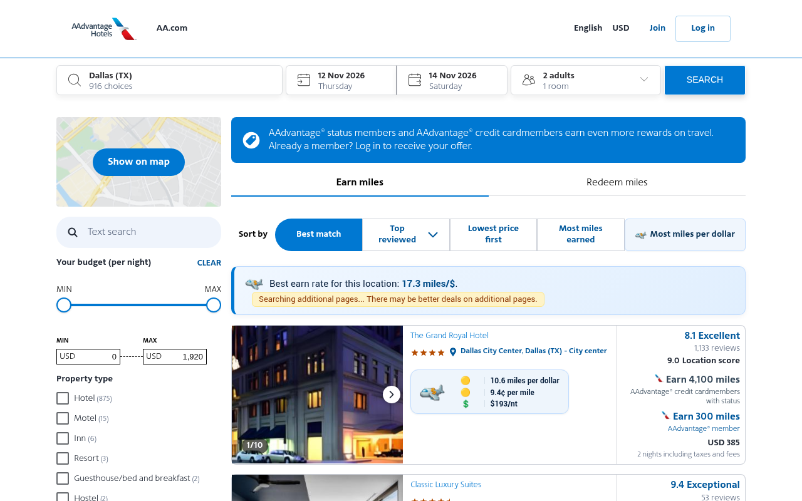
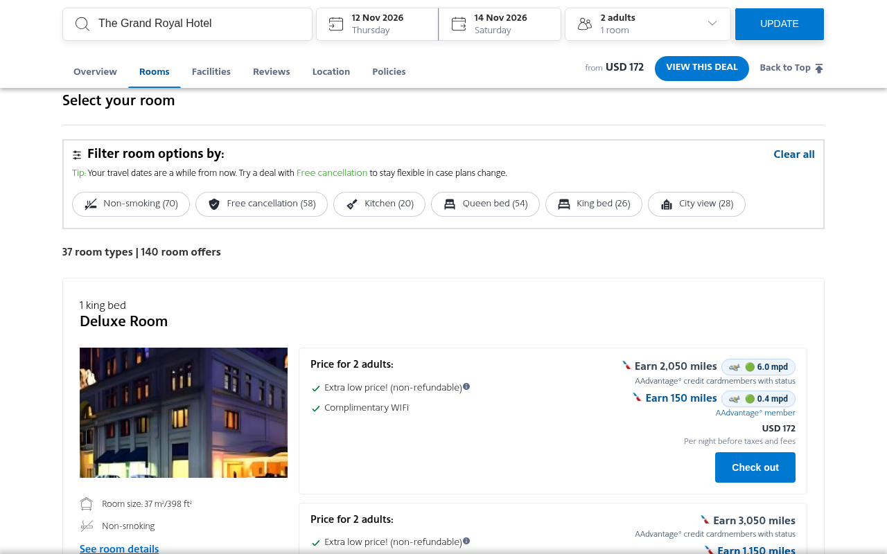
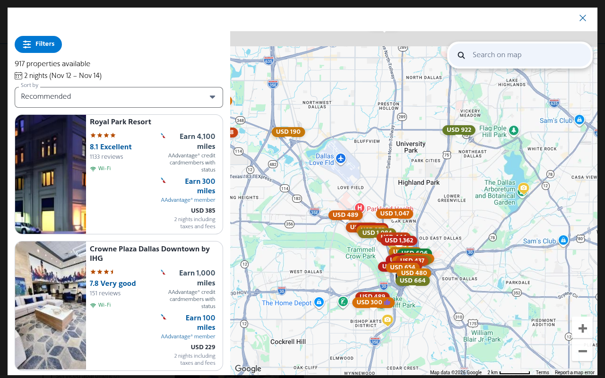
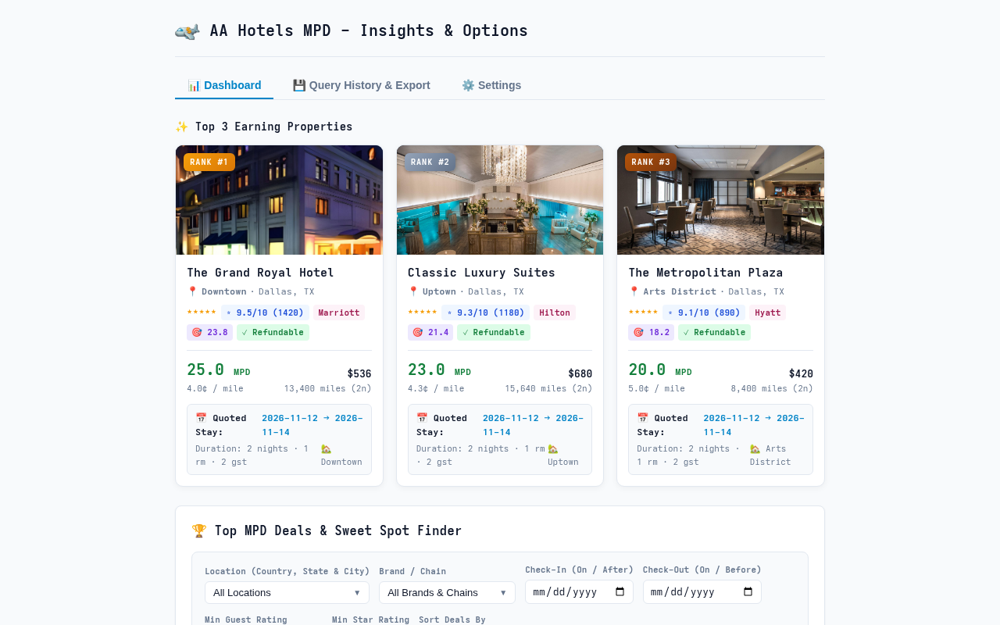

# AA Hotels MPD

A powerful, privacy-first Chrome extension that calculates and displays Miles Per Dollar (MPD), Cents Per Mile (CPM), and comparative value metrics on [AAdvantage Hotels](https://search.aadvantagehotels.com).

[](https://chromewebstore.google.com/detail/aa-hotels-mpd/ojdenlcjodnolmcgdpghhmdlmginhiei)


---

## Key Features

### 1. 3-Row Branded MPD Chips
Every hotel card displays an on-brand, 3-row value chip with the AA Hotels MPD logo:
- **Row 1 — Miles Per Dollar (MPD):** Earn rate with relative tier indicator (🟢 high earn rate, 🟡 medium, 🔴 low).
- **Row 2 — Cents Per Mile (CPM):** Acquisition cost per mile with relative acquisition value indicator.
- **Row 3 — Nightly Rate & Price Rating:** All-in nightly price with 1–3 dollar sign rating (💲 least expensive to 💲💲💲 most expensive in search set).

### 2. Location Best Earn Rate Banner
- Displays prominently right above search results with the top earn rate found across the destination.
- Includes a live spinning logo animation while background queries are running.
- Includes an alert notification informing you if better deals may exist on additional result pages.

### 3. Automated Background Search Pagination
- Headless GraphQL querying for subsequent search result pages (pages 2+).
- **Gated & Configurable:** Controlled by the *"Expand All Search Results automatically"* option, with a configurable max pages depth cap (default: 5 pages).
- **Polite & Safe:** Built-in 3-second base delay with 2 seconds of random jitter (3–5s between queries) to ensure safe, reliable requests.
- Rates from all queried pages are instantly ingested to surface the best earning deals in the location.

### 4. Native MPD Sort
- Adds a branded **"Most miles per dollar"** sort option directly to the native `sort-bar-container` on search pages.
- Sorts results descending by MPD with a single click.

### 5. Configurable Earning Levels & Pricing
- **Earning Level:** Choose between *AAdvantage® Member* and *AAdvantage® Credit Cardmembers with Status* to match your Loyalty Point base earn tier.
- **Pricing Basis:** Option to calculate MPD based on all-in total price (including taxes & fees) or base price.
- **Bonus Miles:** Option to include or exclude promotional bonus miles from room calculations.

### 6. Completely Private & Local
- Runs 100% locally in your browser.
- Zero analytics, zero telemetry, and zero data transmitted to any external servers.

---

## Screenshots

| Search Results | Hotel Room Details |
|:---:|:---:|
|  |  |

| Map View | Extension Options |
|:---:|:---:|
|  |  |

---

## Development

### Prerequisites
- Node.js (v20+)
- npm

### Installation
```bash
npm install
```

### Build
Compile TypeScript and package bundles with Webpack:
```bash
npm run build
```

For live development watch mode:
```bash
npm run watch
```

### Testing
Run unit and integration tests (235+ tests across Vitest):
```bash
npm test
```

### Packaging for Chrome Web Store
```bash
npm run package
```
Generates `extension.zip` containing `manifest.json`, `options.html`, compiled `dist/` scripts, and icons.

---

## Installation in Chrome

1. Clone and build the repository (`npm run build`).
2. Open Chrome and navigate to `chrome://extensions`.
3. Enable **Developer mode** in the top right corner.
4. Click **Load unpacked** and select the repository root directory.
5. Visit [search.aadvantagehotels.com](https://search.aadvantagehotels.com) and search for hotels!

---

## License

MIT
